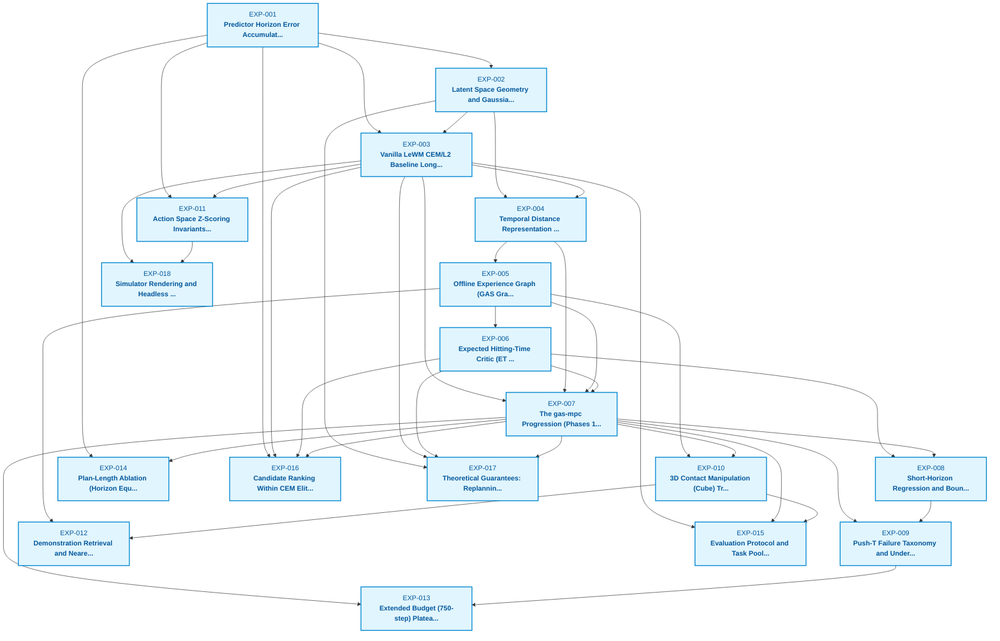

# Research Knowledge Base: Web of Ideas

> **Current Paradigm:** Radical Architectural Rethink & Simplification of Long-Horizon World-Model Planning.
> **Active Cards:** 18 | **Open Questions:** 32

Welcome to the research knowledge base. Each file in this directory represents **one atomic result or experiment**, structured across four sections: (1) Motivation & Provenance, (2) Method & Protocol, (3) Empirical Results, and (4) Synthesis & Next Questions.

---

## Dependency & Emergent Idea Graph

---

## Active Research Frontier: Unresolved Open Questions

The following open questions and bottlenecks have been identified from empirical results and represent active vectors for new experiments:

- **[[EXP-001](EXP-001-predictor-drift.md)]** *(Predictor Horizon Error Accumulation and Gaussian Noise Limit)*: Can multi-step rollout drift be bounded by regularizing latent geometry instead of autoregressive rollout?
- **[[EXP-001](EXP-001-predictor-drift.md)]** *(Predictor Horizon Error Accumulation and Gaussian Noise Limit)*: Does a single-step jump or flow-matching predictor suffer less variance accumulation than autoregressive 5-step block prediction?
- **[[EXP-002](EXP-002-gaussian-shell-ood.md)]** *(Latent Space Geometry and Gaussian Shell OOD Drift)*: Can a non-Euclidean latent distance metric enforce geodesics along the shell without an explicit offline graph?
- **[[EXP-002](EXP-002-gaussian-shell-ood.md)]** *(Latent Space Geometry and Gaussian Shell OOD Drift)*: Does normalizing latent representations to the unit hypersphere (e.g. cosine distance) prevent the interior collapse?
- **[[EXP-003](EXP-003-lewm-l2-baseline.md)]** *(Vanilla LeWM CEM/L2 Baseline Long-Horizon Failure)*: Why does L2 perform exceptionally well at same25 (>91%) despite the predictor error and shell curvature?
- **[[EXP-003](EXP-003-lewm-l2-baseline.md)]** *(Vanilla LeWM CEM/L2 Baseline Long-Horizon Failure)*: Can a planner exploit L2's short-range precision while delegating long-range guidance to a different mechanism?
- **[[EXP-004](EXP-004-tdr-calibration.md)]** *(Temporal Distance Representation (TDR) Mapping and Metric Calibration)*: Can TDR be trained end-to-end with the world model encoder instead of as a post-hoc MLP on frozen latents?
- **[[EXP-004](EXP-004-tdr-calibration.md)]** *(Temporal Distance Representation (TDR) Mapping and Metric Calibration)*: Why does pure TDR objective without a graph fail on cross-episode tasks?
- **[[EXP-005](EXP-005-gas-graph-stitching.md)]** *(Offline Experience Graph (GAS Graph) Topology, TE Filtering, and Shortcuts)*: Can continuous neural path planning (e.g. flow-based geodesics) replace discrete Dijkstra graph search?
- **[[EXP-005](EXP-005-gas-graph-stitching.md)]** *(Offline Experience Graph (GAS Graph) Topology, TE Filtering, and Shortcuts)*: How severely does graph sparsity in 3D contact domains degrade shortest path quality?
- **[[EXP-006](EXP-006-hitting-time-critic.md)]** *(Expected Hitting-Time Critic (ET vs -log P) and Survival Formulations)*: Can the hitting-time critic be trained directly as a continuous scalar regressor without survival bins?
- **[[EXP-006](EXP-006-hitting-time-critic.md)]** *(Expected Hitting-Time Critic (ET vs -log P) and Survival Formulations)*: Why does the critic cost need to be turned off in the final lookahead horizon to prevent short-horizon regression?
- **[[EXP-007](EXP-007-gas-mpc-phases-to-our-method.md)]** *(The gas-mpc Progression (Phases 1-8) and the Consolidated OUR Method Benchmark)*: Can the 5 separate components (JEPA + Predictor + TDR + Graph + Critic) be unified into a single long-horizon architecture?
- **[[EXP-007](EXP-007-gas-mpc-phases-to-our-method.md)]** *(The gas-mpc Progression (Phases 1-8) and the Consolidated OUR Method Benchmark)*: How can the remaining short-range performance deficit on same25 be eliminated without heuristic threshold switches?
- **[[EXP-008](EXP-008-short-horizon-regression.md)]** *(Short-Horizon Regression and Boundary Switching Discontinuities)*: Can a smooth homotopy / potential blending function replace the hard threshold switch at theta_final?
- **[[EXP-008](EXP-008-short-horizon-regression.md)]** *(Short-Horizon Regression and Boundary Switching Discontinuities)*: Does a single continuous flow or diffusion policy eliminate the boundary chattering entirely?
- **[[EXP-009](EXP-009-pusht-failure-taxonomy.md)]** *(Push-T Failure Taxonomy and Under-Actuated Contact Overshoot)*: Why does CEM fail to arrest momentum near the goal, causing 57% of close approaches to regress?
- **[[EXP-009](EXP-009-pusht-failure-taxonomy.md)]** *(Push-T Failure Taxonomy and Under-Actuated Contact Overshoot)*: Can a learned reactive terminal controller lock the object into the goal zone once within tolerance?
- **[[EXP-010](EXP-010-cube-3d-transfer-bottleneck.md)]** *(3D Contact Manipulation (Cube) Transfer Bottleneck and Topological Disconnects)*: Why does explicit graph search fail in high-dimensional 3D contact domains?
- **[[EXP-010](EXP-010-cube-3d-transfer-bottleneck.md)]** *(3D Contact Manipulation (Cube) Transfer Bottleneck and Topological Disconnects)*: Can continuous generative planners (e.g. flow matching on latent trajectories) overcome the exponential sparsity of discrete graphs in 3D manipulation?
- **[[EXP-011](EXP-011-action-normalization-invariants.md)]** *(Action Space Z-Scoring Invariants, Checkpoint Health, and Silent Failure Modes)*: How can we implement automated compile-time or runtime assertion wrappers to guarantee no un-normalized actions ever reach a world model?
- **[[EXP-011](EXP-011-action-normalization-invariants.md)]** *(Action Space Z-Scoring Invariants, Checkpoint Health, and Silent Failure Modes)*: Can action normalization be made self-contained inside the model checkpoint rather than requiring external preprocessing?
- **[[EXP-012](EXP-012-demonstration-retrieval.md)]** *(Demonstration Retrieval and Nearest-Neighbor Action Seeding)*: Why does demonstration retrieval provide substantial lift on Cube but zero benefit on Push-T?
- **[[EXP-012](EXP-012-demonstration-retrieval.md)]** *(Demonstration Retrieval and Nearest-Neighbor Action Seeding)*: Can retrieval-augmented CEM be replaced by an amortized actor policy?
- **[[EXP-013](EXP-013-extended-budget-limit-cycles.md)]** *(Extended Budget (750-step) Plateau and Limit Cycles)*: Why does tripling the execution budget fail to resolve failing episodes?
- **[[EXP-013](EXP-013-extended-budget-limit-cycles.md)]** *(Extended Budget (750-step) Plateau and Limit Cycles)*: How can long-horizon planners break out of cyclical attractor orbits in latent space?
- **[[EXP-014](EXP-014-replan-frequency-ablation.md)]** *(Plan-Length Ablation (Horizon Equals Receding Horizon))*: At a fixed planning horizon, does more frequent replanning improve or degrade performance?
- **[[EXP-014](EXP-014-replan-frequency-ablation.md)]** *(Plan-Length Ablation (Horizon Equals Receding Horizon))*: Can a closed-loop policy execute actions without the discrete replanning latency of MPC?
- **[[EXP-015](EXP-015-task-pool-integrity.md)]** *(Evaluation Protocol and Task Pool Integrity (task200u vs legacy task200))*: How can automated benchmark assertions prevent pre-solved or degenerate task pairs from entering evaluation pools?
- **[[EXP-016](EXP-016-candidate-ranking-correlations.md)]** *(Candidate Ranking Within CEM Elites and Horizon Correlation Audits)*: Can a planner maintain high candidate ranking correlation without requiring an ensemble or multi-step rollout?
- **[[EXP-017](EXP-017-theoretical-bounds-and-guarantees.md)]** *(Theoretical Guarantees: Replanning Bounds, Local Convergence, and the Exact-Model L2 Trap)*: Can theoretical progress bounds be established for continuous generative trajectory planners without discrete graph assumptions?
- **[[EXP-018](EXP-018-simulator-rendering-and-egl-parity.md)]** *(Simulator Rendering and Headless EGL Environment Parity)*: How can automated visual rendering regression tests prevent camera distortion bugs on remote HPC nodes?

---

## Master Card Registry

| ID | Title | Status | Tags | Derived From | Leads To |
| :--- | :--- | :---: | :--- | :--- | :--- |
| **[EXP-001](EXP-001-predictor-drift.md)** | Predictor Horizon Error Accumulation and Gaussian Noise Limit | `established` | dynamics, lewm-predictor, error-accumulation, bounds | - | [EXP-002](EXP-002-gaussian-shell-ood.md), [EXP-003](EXP-003-lewm-l2-baseline.md), [EXP-011](EXP-011-action-normalization-invariants.md), [EXP-014](EXP-014-replan-frequency-ablation.md), [EXP-016](EXP-016-candidate-ranking-correlations.md) |
| **[EXP-002](EXP-002-gaussian-shell-ood.md)** | Latent Space Geometry and Gaussian Shell OOD Drift | `established` | geometry, gaussian-shells, ood, latent-space, cursed-dimensions | [EXP-001](EXP-001-predictor-drift.md) | [EXP-003](EXP-003-lewm-l2-baseline.md), [EXP-004](EXP-004-tdr-calibration.md), [EXP-017](EXP-017-theoretical-bounds-and-guarantees.md) |
| **[EXP-003](EXP-003-lewm-l2-baseline.md)** | Vanilla LeWM CEM/L2 Baseline Long-Horizon Failure | `established` | baselines, lewm, cem, failure-modes, benchmarks | [EXP-001](EXP-001-predictor-drift.md), [EXP-002](EXP-002-gaussian-shell-ood.md) | [EXP-004](EXP-004-tdr-calibration.md), [EXP-007](EXP-007-gas-mpc-phases-to-our-method.md), [EXP-011](EXP-011-action-normalization-invariants.md), [EXP-015](EXP-015-task-pool-integrity.md), [EXP-016](EXP-016-candidate-ranking-correlations.md), [EXP-017](EXP-017-theoretical-bounds-and-guarantees.md), [EXP-018](EXP-018-simulator-rendering-and-egl-parity.md) |
| **[EXP-004](EXP-004-tdr-calibration.md)** | Temporal Distance Representation (TDR) Mapping and Metric Calibration | `established` | tdr, metric-learning, calibration, gas, representations | [EXP-002](EXP-002-gaussian-shell-ood.md), [EXP-003](EXP-003-lewm-l2-baseline.md) | [EXP-005](EXP-005-gas-graph-stitching.md), [EXP-007](EXP-007-gas-mpc-phases-to-our-method.md) |
| **[EXP-005](EXP-005-gas-graph-stitching.md)** | Offline Experience Graph (GAS Graph) Topology, TE Filtering, and Shortcuts | `established` | graph, dijkstra, subgoals, gas, clustering, topology | [EXP-004](EXP-004-tdr-calibration.md) | [EXP-006](EXP-006-hitting-time-critic.md), [EXP-007](EXP-007-gas-mpc-phases-to-our-method.md), [EXP-010](EXP-010-cube-3d-transfer-bottleneck.md), [EXP-012](EXP-012-demonstration-retrieval.md) |
| **[EXP-006](EXP-006-hitting-time-critic.md)** | Expected Hitting-Time Critic (ET vs -log P) and Survival Formulations | `established` | critic, hitting-time, viability, bellman-backup, cost-composition | [EXP-005](EXP-005-gas-graph-stitching.md) | [EXP-007](EXP-007-gas-mpc-phases-to-our-method.md), [EXP-008](EXP-008-short-horizon-regression.md), [EXP-016](EXP-016-candidate-ranking-correlations.md), [EXP-017](EXP-017-theoretical-bounds-and-guarantees.md) |
| **[EXP-007](EXP-007-gas-mpc-phases-to-our-method.md)** | The gas-mpc Progression (Phases 1-8) and the Consolidated OUR Method Benchmark | `established` | gas-mpc, our-method, benchmarks, headline-results, ablation-study, synthesis | [EXP-003](EXP-003-lewm-l2-baseline.md), [EXP-004](EXP-004-tdr-calibration.md), [EXP-005](EXP-005-gas-graph-stitching.md), [EXP-006](EXP-006-hitting-time-critic.md) | [EXP-008](EXP-008-short-horizon-regression.md), [EXP-009](EXP-009-pusht-failure-taxonomy.md), [EXP-010](EXP-010-cube-3d-transfer-bottleneck.md), [EXP-013](EXP-013-extended-budget-limit-cycles.md), [EXP-014](EXP-014-replan-frequency-ablation.md), [EXP-015](EXP-015-task-pool-integrity.md), [EXP-016](EXP-016-candidate-ranking-correlations.md), [EXP-017](EXP-017-theoretical-bounds-and-guarantees.md) |
| **[EXP-008](EXP-008-short-horizon-regression.md)** | Short-Horizon Regression and Boundary Switching Discontinuities | `established` | failure-modes, short-horizon, switching-thresholds, cem-chattering, continuity | [EXP-006](EXP-006-hitting-time-critic.md), [EXP-007](EXP-007-gas-mpc-phases-to-our-method.md) | [EXP-009](EXP-009-pusht-failure-taxonomy.md) |
| **[EXP-009](EXP-009-pusht-failure-taxonomy.md)** | Push-T Failure Taxonomy and Under-Actuated Contact Overshoot | `established` | failure-analysis, pusht, contact-dynamics, under-actuated, overshoot | [EXP-007](EXP-007-gas-mpc-phases-to-our-method.md), [EXP-008](EXP-008-short-horizon-regression.md) | [EXP-013](EXP-013-extended-budget-limit-cycles.md) |
| **[EXP-010](EXP-010-cube-3d-transfer-bottleneck.md)** | 3D Contact Manipulation (Cube) Transfer Bottleneck and Topological Disconnects | `established` | cube, 3d-manipulation, ogbench, transfer-limits, graph-sparsity, contact-physics | [EXP-005](EXP-005-gas-graph-stitching.md), [EXP-007](EXP-007-gas-mpc-phases-to-our-method.md) | [EXP-012](EXP-012-demonstration-retrieval.md), [EXP-015](EXP-015-task-pool-integrity.md) |
| **[EXP-011](EXP-011-action-normalization-invariants.md)** | Action Space Z-Scoring Invariants, Checkpoint Health, and Silent Failure Modes | `established` | invariants, action-normalization, silent-failures, sanity-checks, cluster-ops | [EXP-001](EXP-001-predictor-drift.md), [EXP-003](EXP-003-lewm-l2-baseline.md) | [EXP-018](EXP-018-simulator-rendering-and-egl-parity.md) |
| **[EXP-012](EXP-012-demonstration-retrieval.md)** | Demonstration Retrieval and Nearest-Neighbor Action Seeding | `established` | retrieval, action-seeding, warm-start, ogbench-cube, cem-proposals | [EXP-005](EXP-005-gas-graph-stitching.md), [EXP-010](EXP-010-cube-3d-transfer-bottleneck.md) | - |
| **[EXP-013](EXP-013-extended-budget-limit-cycles.md)** | Extended Budget (750-step) Plateau and Limit Cycles | `established` | extended-budget, limit-cycles, pusht, asymptotic-performance, failure-modes | [EXP-007](EXP-007-gas-mpc-phases-to-our-method.md), [EXP-009](EXP-009-pusht-failure-taxonomy.md) | - |
| **[EXP-014](EXP-014-replan-frequency-ablation.md)** | Plan-Length Ablation (Horizon Equals Receding Horizon) | `established` | receding-horizon, replanning-frequency, open-loop-execution, cem-control | [EXP-001](EXP-001-predictor-drift.md), [EXP-007](EXP-007-gas-mpc-phases-to-our-method.md) | - |
| **[EXP-015](EXP-015-task-pool-integrity.md)** | Evaluation Protocol and Task Pool Integrity (task200u vs legacy task200) | `established` | evaluation-protocol, benchmarks, task-pools, data-hygiene, artifacts | [EXP-003](EXP-003-lewm-l2-baseline.md), [EXP-007](EXP-007-gas-mpc-phases-to-our-method.md), [EXP-010](EXP-010-cube-3d-transfer-bottleneck.md) | - |
| **[EXP-016](EXP-016-candidate-ranking-correlations.md)** | Candidate Ranking Within CEM Elites and Horizon Correlation Audits | `established` | spearman-correlation, candidate-ranking, cem-elites, oracle-audit, diagnostics | [EXP-001](EXP-001-predictor-drift.md), [EXP-003](EXP-003-lewm-l2-baseline.md), [EXP-006](EXP-006-hitting-time-critic.md), [EXP-007](EXP-007-gas-mpc-phases-to-our-method.md) | - |
| **[EXP-017](EXP-017-theoretical-bounds-and-guarantees.md)** | Theoretical Guarantees: Replanning Bounds, Local Convergence, and the Exact-Model L2 Trap | `established` | theory, proofs, replanning-bounds, bellman-contraction, exact-model-trap, iclr-theorems | [EXP-002](EXP-002-gaussian-shell-ood.md), [EXP-003](EXP-003-lewm-l2-baseline.md), [EXP-006](EXP-006-hitting-time-critic.md), [EXP-007](EXP-007-gas-mpc-phases-to-our-method.md) | - |
| **[EXP-018](EXP-018-simulator-rendering-and-egl-parity.md)** | Simulator Rendering and Headless EGL Environment Parity | `established` | rendering, egl, mujoco, data-parity, cluster-ops, visual-alignment | [EXP-003](EXP-003-lewm-l2-baseline.md), [EXP-011](EXP-011-action-normalization-invariants.md) | - |

---

## How to Use This Knowledge Base

1. **Scaffold a new card**: Run `python scripts/tools/kb_manager.py new --title "..." --derived-from EXP-XXX`.
2. **Validate integrity**: Run `python scripts/tools/kb_manager.py validate` to check links and schemas.
3. **Synchronize index & DAG**: Run `python scripts/tools/kb_manager.py sync-index` to update this document.
4. **Agentic Ideation**: Agents inspect the open questions above, propose hypotheses targeting open bottlenecks, and scaffold new cards.
